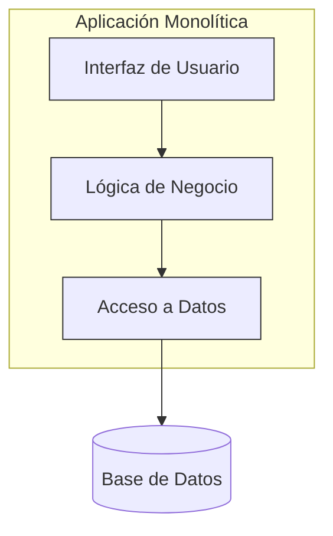

# Capítulo 3: Arquitectura Monolítica en Profundidad

La **arquitectura monolítica** es el enfoque tradicional para el desarrollo de software, donde una aplicación se construye como una **única unidad, cohesiva e indivisible**. Todos los componentes, como la interfaz de usuario, la lógica de negocio y la capa de acceso a datos, están acoplados y se ejecutan en el mismo proceso.

Imagina una gran caja que contiene absolutamente todo lo necesario para que la aplicación funcione. Para hacer cualquier cambio, debes abrir esa caja, modificar una pieza y luego volver a empaquetar y desplegar la caja completa.

### **Componentes y Estructura**

Aunque es una sola unidad, internamente un monolito suele estar organizado lógicamente en capas o módulos. Una estructura típica incluye:

* **Interfaz de Usuario (UI):** El código responsable de renderizar la interfaz para el usuario (HTML, CSS, JavaScript).  
* **Lógica de Negocio (Business Logic):** El núcleo de la aplicación, donde residen las reglas y procesos del negocio.  
* **Capa de Acceso a Datos (DAL):** Componentes que gestionan la comunicación con la base de datos.  
* **Base de Datos Única:** Generalmente, toda la aplicación se conecta a una única base de datos centralizada.

### **Diagrama de Arquitectura Monolítica**

### **Ventajas y Desventajas**

| Ventajas 👍 | Desventajas 👎 |
| :---- | :---- |
| **Simplicidad en el Desarrollo:** Al inicio, es más fácil y rápido de desarrollar, ya que todo está en un solo lugar. | **Difícil de Escalar:** No se puede escalar una parte de la aplicación; se debe escalar todo el monolito. |
| **Despliegue Sencillo:** Solo hay que desplegar un único archivo o paquete. | **Acoplamiento Fuerte:** Un cambio en un componente puede afectar a otros de manera inesperada. |
| **Menor Latencia:** La comunicación entre componentes es interna y muy rápida (llamadas a funciones). | **Barrera Tecnológica:** Es difícil adoptar nuevas tecnologías; toda la aplicación está "atada" a un stack tecnológico. |
| **Fácil de Testear (End-to-End):** Probar el flujo completo de la aplicación es más directo. | **Despliegues Lentos y Riesgosos:** Cualquier pequeño cambio requiere volver a desplegar toda la aplicación, aumentando el riesgo. |

