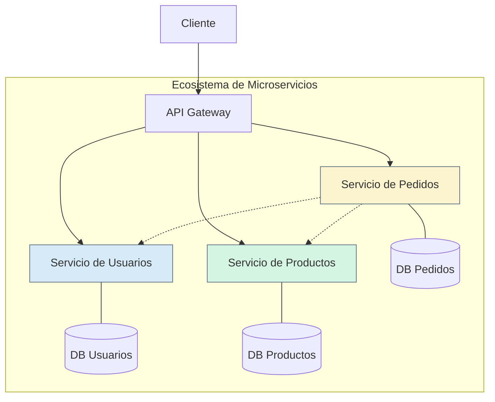

# Capítulo 4: Arquitectura de Microservicios en Profundidad

La **arquitectura de microservicios** es un enfoque en el que una aplicación grande se descompone en un conjunto de **servicios pequeños, independientes y débilmente acoplados**. Cada servicio se centra en una capacidad de negocio específica, se desarrolla y despliega de forma autónoma, y se comunica con otros servicios a través de APIs bien definidas, comúnmente sobre HTTP (REST) o mensajería asíncrona.

Piensa en un equipo de especialistas: en lugar de tener un "sabelotodo" (el monolito), tienes un experto en pagos, otro en inventario y otro en usuarios. Cada uno trabaja de forma independiente pero colaboran para lograr un objetivo común.

### **Componentes y Estructura**

Un ecosistema de microservicios tiene varias partes clave:

* **Servicios Individuales:** Cada uno es una mini-aplicación con su propia lógica y, a menudo, su propia base de datos.  
* **API Gateway:** Un punto de entrada único que enruta las peticiones de los clientes a los servicios correspondientes. Simplifica el acceso y puede manejar la autenticación, el balanceo de carga, etc.  
* **Comunicación:** Los servicios se comunican entre sí. Puede ser síncrona (ej. API REST) o asíncrona (ej. a través de un bus de mensajes).  
* **Bases de Datos por Servicio:** Cada servicio gestiona sus propios datos, lo que garantiza el desacoplamiento.

### **Diagrama de Arquitectura de Microservicios**

### **Ventajas y Desventajas**

| Ventajas 👍 | Desventajas 👎 |
| ----- | ----- |
| **Escalabilidad Independiente:** Cada servicio puede escalarse por separado según su demanda específica. | **Complejidad Operacional:** Gestionar, desplegar y monitorizar muchos servicios es un desafío (DevOps). |
| **Autonomía de Equipos:** Equipos pequeños pueden desarrollar, desplegar y mantener sus servicios de forma independiente. | **Complejidad Distribuida:** Se deben manejar fallos en la red, latencia y consistencia de datos entre servicios. |
| **Flexibilidad Tecnológica:** Cada servicio puede usar la tecnología más adecuada para su tarea (poliglotismo). | **Dificultad en Pruebas:** Probar interacciones entre múltiples servicios es más complejo que en un monolito. |
| **Despliegues Rápidos y Seguros:** Se pueden actualizar servicios individuales sin afectar al resto de la aplicación. | **Consistencia de Datos:** Mantener la consistencia de los datos a través de múltiples bases de datos puede ser difícil (ej. sagas). |

