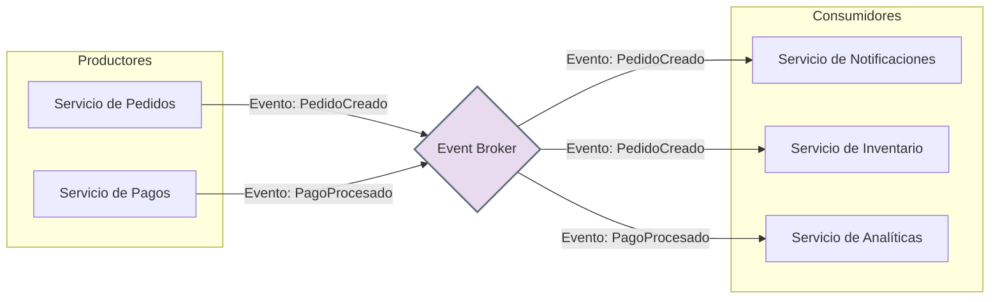

# Capítulo 5: Arquitectura Orientada a Eventos en Profundidad

La **Arquitectura Orientada a Eventos (EDA)** es un paradigma en el que la comunicación entre los componentes del software se realiza mediante la producción y el consumo de **eventos**. Un evento es una notificación de que "algo ha sucedido" en el sistema (ej. "se ha creado un nuevo pedido", "el inventario ha bajado").

En lugar de que un servicio llame directamente a otro (comunicación síncrona), un servicio **produce** un evento y lo envía a un canal central, sin saber quién o cuántos lo recibirán. Otros servicios se **suscriben** a esos eventos y reaccionan cuando ocurren. Esto crea un sistema altamente **desacoplado y asíncrono**.

### **Componentes y Estructura**

Los actores principales en una EDA son:

* **Productor de Eventos (Event Producer):** El componente que origina el evento. Por ejemplo, un servicio de pedidos que emite un evento `PedidoCreado`.  
* **Consumidor de Eventos (Event Consumer):** El componente que se suscribe y reacciona a un evento. Por ejemplo, un servicio de notificaciones que escucha `PedidoCreado` para enviar un email.  
* **Broker de Eventos (Event Broker / Bus):** El intermediario que recibe los eventos de los productores y los distribuye a los consumidores interesados. Es el corazón del sistema (ej. RabbitMQ, Apache Kafka, AWS SNS).

### **Diagrama de Arquitectura Orientada a Eventos**

### **Ventajas y Desventajas**

| Ventajas 👍 | Desventajas 👎 |
| ----- | ----- |
| **Alto Desacoplamiento:** Los productores y consumidores no se conocen entre sí. Se pueden añadir o quitar consumidores sin afectar a los productores. | **Complejidad en el Flujo:** Rastrear un flujo de negocio a través de múltiples eventos y servicios puede ser muy difícil. |
| **Escalabilidad y Elasticidad:** Es fácil añadir más consumidores para procesar eventos en paralelo y manejar picos de carga. | **Gestión del Broker:** El broker de eventos es un punto crítico. Debe ser altamente disponible y robusto. |
| **Resiliencia:** Si un consumidor falla, los eventos pueden ser almacenados en el broker y procesados más tarde, evitando la pérdida de datos. | **Consistencia Eventual:** Los datos se vuelven consistentes a lo largo del tiempo, no de forma inmediata, lo que puede ser un desafío para algunos casos de uso. |
| **Capacidad de Respuesta en Tiempo Real:** Los sistemas pueden reaccionar instantáneamente a los cambios, lo que es ideal para aplicaciones interactivas. | **Depuración y Pruebas:** Depurar un sistema asíncrono y distribuido es considerablemente más complejo. |
