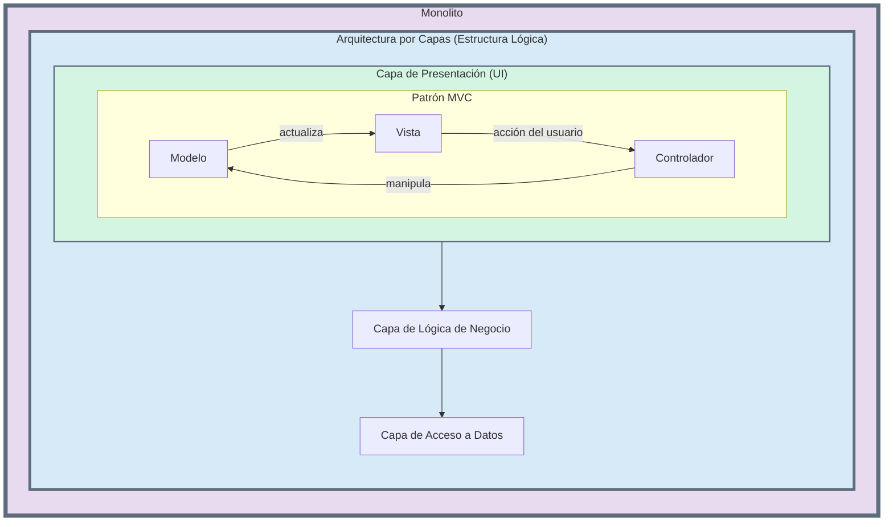

# Capítulo 6: Diferencias: Monolito, Por Capas y MVC

Es muy común confundir los conceptos de **Monolito**, **Arquitectura por Capas** y **MVC (Modelo-Vista-Controlador)**, pero en realidad describen aspectos diferentes de un sistema y no son mutuamente excluyentes. De hecho, a menudo coexisten.

Vamos a aclarar la diferencia:

1. **Monolito (Estilo de Despliegue):**  
   * **¿Qué es?** Se refiere a **CÓMO SE EMPAQUETA Y DESPLIEGA** la aplicación. Un monolito es una **única unidad de despliegue**. Todo el código base se compila, empaqueta y despliega como un solo artefacto (ej. un archivo `.war`, un ejecutable).  
   * **Nivel:** Es un concepto a nivel de **infraestructura y despliegue**.  
2. **Arquitectura por Capas (Patrón Arquitectónico):**  
   * **¿Qué es?** Se refiere a **CÓMO SE ESTRUCTURA LÓGICAMENTE** el código **DENTRO** de la aplicación. Organiza el código en capas horizontales con responsabilidades claras (Presentación, Lógica de Negocio, Acceso a Datos).  
   * **Nivel:** Es un concepto a nivel de **organización del código**. Una aplicación monolítica casi siempre está organizada internamente usando una arquitectura por capas.  
3. **MVC (Patrón de Diseño):**  
   * **¿Qué es?** Se refiere a **CÓMO SE ORGANIZA EL CÓDIGO DE UNA PARTE ESPECÍFICA** de la aplicación, generalmente la **capa de presentación o interfaz de usuario**. Separa la lógica en tres componentes interconectados:  
     * **Modelo:** Los datos y la lógica de negocio.  
     * **Vista:** La representación visual de los datos.  
     * **Controlador:** Maneja la entrada del usuario y coordina entre el Modelo y la Vista.  
   * **Nivel:** Es un patrón a nivel de **diseño de componentes**, comúnmente aplicado dentro de la capa de presentación de una arquitectura por capas.

### **La Relación entre Ellos**

La mejor manera de entenderlo es como muñecas rusas:

**Una aplicación monolítica (la muñeca más grande) a menudo se implementa utilizando una arquitectura por capas (la muñeca mediana). A su vez, la capa de presentación de esa arquitectura puede estar implementada utilizando el patrón de diseño MVC (la muñeca más pequeña).**

### **Diagrama de Relación**

