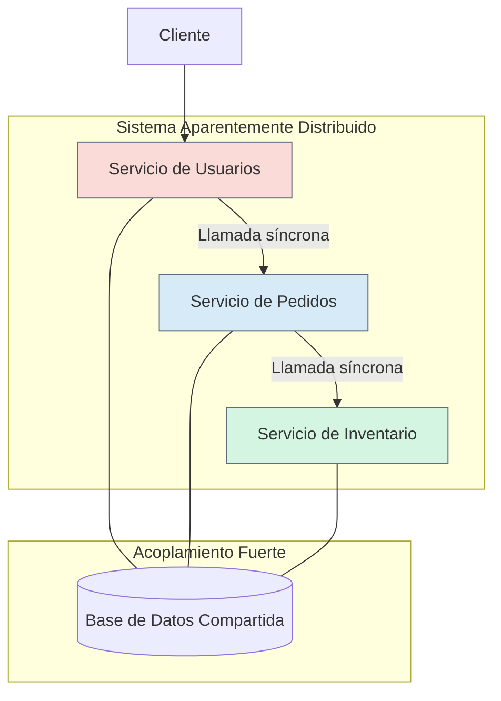
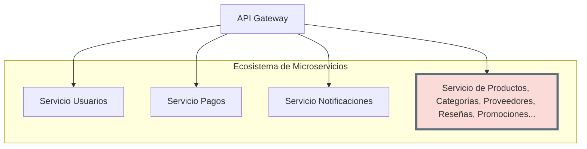

# Capítulo 7: Casos Borde y Antipatrones del Monolito

Si bien la arquitectura monolítica es conceptualmente simple, su evolución y su interacción con otros estilos arquitectónicos pueden dar lugar a "antipatrones": soluciones que parecen buenas a primera vista pero que generan problemas complejos a largo plazo. Entender estos casos borde es crucial para mantener la salud de un sistema.

### **El Antipatrón del "Monolito Distribuido"**

Este es quizás el peor de los dos mundos. Ocurre cuando un sistema se diseña para parecerse a microservicios (múltiples servicios que se despliegan por separado), pero están tan **fuertemente acoplados** que en la práctica se comportan como un monolito.

* **¿Cómo se ve?** Varios servicios que dependen de llamadas síncronas entre sí para completar una sola transacción. Un cambio en el servicio A requiere un cambio y un redespliegue coordinado del servicio B y C. A menudo, comparten una única base de datos.  
* **Consecuencias:** Se obtiene toda la complejidad operacional de un sistema distribuido (latencia de red, fallos en cascada, dificultad de depuración) sin ninguno de sus beneficios clave, como el despliegue independiente o la resiliencia.

#### **Diagrama del Monolito Distribuido**

### **El Problema del "Micro-Monolito"**

Como mencionamos, este es un escenario muy común. Ocurre dentro de una arquitectura de microservicios, donde **un servicio individual crece desproporcionadamente** y acumula demasiadas responsabilidades no relacionadas.

* **¿Cómo se ve?** Un servicio que comenzó gestionando "Productos" ahora también maneja categorías, proveedores, reseñas, y promociones. Su base de código es enorme en comparación con otros servicios y cualquier cambio en él es lento y riesgoso.  
* **Consecuencias:** Este servicio se convierte en un **cuello de botella**. Los equipos no pueden trabajar en paralelo en sus funcionalidades, y su despliegue se vuelve tan complejo como el de un monolito completo, anulando los beneficios de la arquitectura de microservicios para esa área del negocio.

#### **Diagrama del Micro-Monolito**

En ambos casos, el problema fundamental radica en una mala gestión del **acoplamiento** y la falta de **límites de contexto** claros. La clave no es solo elegir entre monolito o microservicios, sino definir y proteger rigurosamente las fronteras entre las distintas partes de la funcionalidad del negocio.

