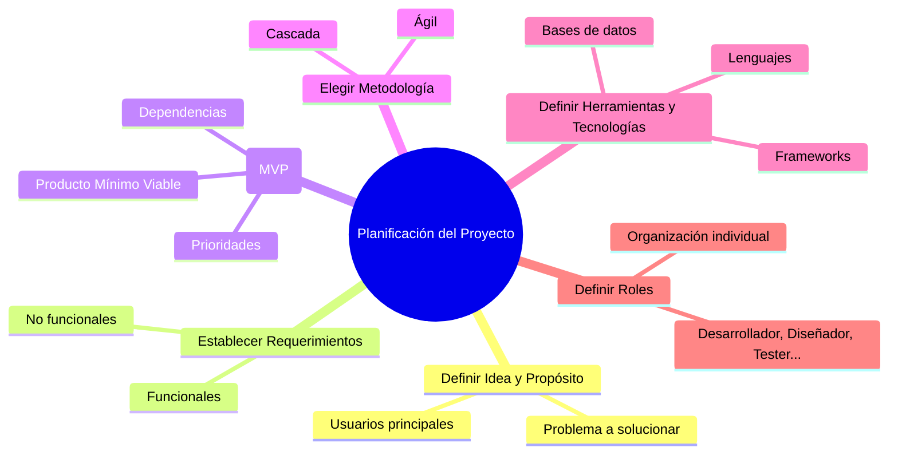

# Capítulo 2: Cómo Planificar un Proyecto de Software

La planificación es una de las etapas más importantes en el desarrollo de software. Un buen plan puede ayudarte a evitar problemas a futuro, optimizar los recursos y asegurar que el producto final cumpla con los objetivos propuestos.

## Definir la Idea y el Propósito del Proyecto

Antes de comenzar a programar, es fundamental tener una idea clara del problema que el software resolverá y quiénes serán sus usuarios. Algunas preguntas clave que puedes hacerte:

* ¿Qué problema intenta solucionar el software? 
* ¿Quiénes serán los usuarios principales? 
* ¿Cuáles son las necesidades y expectativas de los usuarios? 

## Establecer los Requerimientos del Software

Los requerimientos definen lo que el software debe hacer. Se dividen en:
* **Funcionales:** Características específicas del software (por ejemplo, "el usuario puede registrarse").
* **No funcionales:** Requisitos como seguridad, rendimiento y escalabilidad.

Hay muchas plantillas que pueden ayudarte a dejar bien claros los requerimientos del proyecto. Por ejemplo, los casos de uso o las historias de usuario son formas simples pero efectivas de describir qué debe hacer tu software, y te permiten identificar tanto requerimientos funcionales como no funcionales sin complicarte demasiado.

Cuando estés escribiendo estos requerimientos, te puede servir hacerte preguntas como:

* ¿Qué problema específico le estoy resolviendo al usuario con esta funcionalidad? 
* ¿Cómo sabré si esta función cumple su objetivo? 
* ¿Qué pasos va a seguir el usuario para usar esta función? 
* ¿Qué espera ver o recibir el usuario después de realizar una acción? 
* ¿Qué tan crítico es el tiempo de respuesta para esta funcionalidad? 
* ¿Qué pasa si algo falla? ¿Cómo se lo comunico al usuario? 
* ¿Esta función es fácil de entender o necesita explicación? 

Este tipo de preguntas te ayuda a ponerte en los zapatos del usuario y pensar más allá del código: te permite diseñar soluciones que realmente sean útiles, usables y con sentido.

## Crear un Alcance del Proyecto

Es importante definir qué funcionalidades vas a incluir en la primera versión del software y cuáles podrías dejar para más adelante. Esto evita que el proyecto crezca demasiado desde el principio y se vuelva difícil de manejar. Lo ideal es enfocarse en lo que se conoce como un **MVP (Minimum Viable Product)**, o producto mínimo viable: la versión más simple del producto que es útil para el usuario. Piensa en lo mínimo necesario para que alguien lo pueda usar y obtener valor. Identifica las funciones básicas, las prioridades y también las dependencias entre funcionalidades (qué cosas necesitan otras para funcionar). A partir de ahí, vas a tener una idea más clara de qué construir primero y en qué orden avanzar.

## Elegir la Metodología de Trabajo

Dependiendo del tamaño y la complejidad del proyecto, puedes optar por:

* **Cascada:** Ideal para proyectos con requisitos bien definidos y poca necesidad de cambios.
* **Ágil:** Recomendado para proyectos donde los requerimientos pueden cambiar o evolucionar con el tiempo.

## Definir las Herramientas y Tecnologías a Utilizar

Seleccionar el stack tecnológico adecuado para tu proyecto es clave. Algunas decisiones importantes incluyen:

* Lenguajes de programación (JavaScript, Python, Java, etc.).
* Bases de datos (SQL vs. NoSQL).
* Frameworks y librerías necesarias.

Es importante tener en cuenta que si tú o tu equipo tienen experiencia limitada en ciertas tecnologías, estas probablemente serán las que utilicen, a menos que tu empresa ya tenga un stack tecnológico definido al que debas adaptarte. Si tienes la flexibilidad para elegir nuevas tecnologías, aprovecha la oportunidad para elegir una que te interese aprender. Si tienes dudas, también puedes investigar las tendencias actuales o revisar qué tecnologías son más solicitadas en las ofertas laborales de tu área.

## Definir Roles en un Equipo Pequeño (o Cómo Organizarte Si Estás Solo)

Si estás trabajando en un equipo pequeño, es esencial definir roles claros para que cada miembro se enfoque en tareas específicas, lo que evitará confusiones y permitirá avanzar de manera ordenada. Algunos roles comunes en un equipo pequeño de desarrollo pueden ser:

* **Desarrollador Principal:** Encargado de escribir la mayoría del código y garantizar que se cumplan los requisitos del software.
* **Diseñador:** Responsable de la interfaz de usuario y la experiencia de usuario.
* **Tester:** Se asegura de que el software funcione correctamente mediante pruebas manuales o automatizadas.
* **Gestor de Proyecto (Scrum Master):** Coordina tareas, plazos y recursos, asegurándose de que el proyecto avance según lo planificado. En el contexto de metodologías ágiles, también actúa como Scrum Master, facilitando la comunicación entre el equipo y eliminando obstáculos para el progreso del proyecto.
* **Product Owner:** Define la visión del producto, prioriza las funcionalidades y se asegura de que el equipo desarrolle lo que realmente es valioso para el usuario o el negocio. Es el punto de contacto entre los stakeholders y el equipo de desarrollo.

Si trabajas solo, es importante asumir estos roles, o bien organizarlos adecuadamente en función de tus capacidades y prioridades. En este caso, herramientas de gestión como Trello o Notion pueden ayudarte a dividir el trabajo de manera efectiva, asignándote tareas específicas y siguiendo un cronograma claro.

