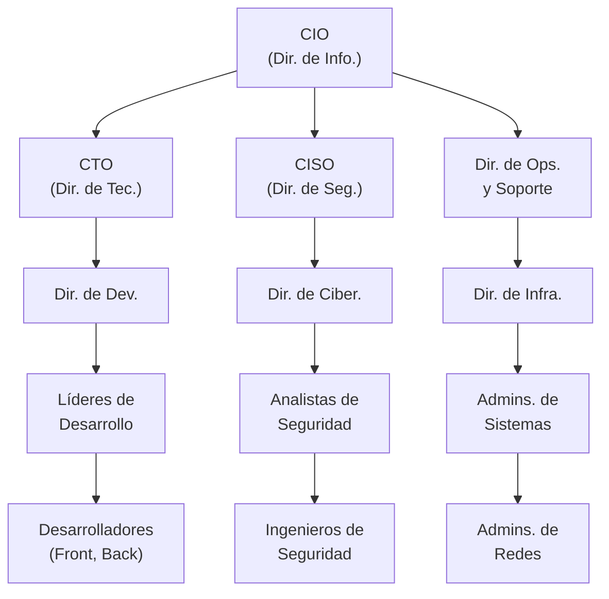

# Capítulo 4: Estructuras Jerárquicas y Líneas de Reporte en el Departamento de TI

La forma en que se estructura un departamento de TI y se definen sus líneas de reporte tiene un impacto directo en su agilidad, eficiencia y capacidad para alinearse con los objetivos de la empresa. No existe un modelo único que sirva para todas las organizaciones; la estructura ideal depende del tamaño de la empresa, su industria, su cultura y su nivel de madurez digital.

## Modelos de Organigramas de TI

Se pueden identificar varios modelos de estructura organizacional, cada uno con sus propias ventajas y desventajas.

* **Estructura Centralizada:** En este modelo, todas las funciones y recursos de TI se concentran en un único departamento que sirve a toda la organización. Este enfoque promueve la estandarización de tecnologías y procesos, un mayor control sobre la seguridad y la optimización de costos a través de economías de escala. Sin embargo, puede generar cuellos de botella en la toma de decisiones y una menor capacidad de respuesta a las necesidades específicas de las unidades de negocio.
* **Estructura Descentralizada:** Aquí, las funciones de TI se distribuyen entre las diferentes unidades de negocio o departamentos. Cada unidad tiene su propio equipo de TI, lo que permite una mayor agilidad y una alineación más estrecha con las necesidades específicas de esa área. El principal riesgo es la duplicación de esfuerzos y recursos, la falta de estándares globales y la dificultad para mantener una estrategia de seguridad coherente en toda la organización. 
* **Estructura Matricial o Híbrida:** Este modelo busca combinar lo mejor de ambos mundos. Mantiene un equipo de TI centralizado para funciones globales como la infraestructura, la seguridad y la gobernanza, mientras que los especialistas de TI (como analistas de negocio o desarrolladores) se asignan a equipos de proyecto multifuncionales o unidades de negocio. Esto fomenta la colaboración y la especialización, pero puede crear complejidad en las líneas de reporte, ya que un empleado puede reportar tanto a un gerente funcional (de TI) como a un gerente de proyecto o de negocio.

A continuación, se presenta un ejemplo de organigrama genérico para un departamento de TI de tamaño mediano a grande, que ilustra la jerarquía y la división funcional.

## Jerarquía de Liderazgo en TI

La cadena de mando dentro de TI está diseñada para traducir la estrategia de alto nivel en ejecución técnica.

* **Líder de Equipo (Team Lead) / Líder Técnico (Tech Lead):** Es el primer nivel de liderazgo, generalmente ocupado por un profesional senior. Lidera un pequeño equipo de especialistas, siendo el principal referente técnico, mentor y responsable de la calidad técnica de los entregables del equipo.
* **Gerente de TI (IT Manager):** Supervisa un área funcional (p. ej., Gerente de Desarrollo) o un conjunto de proyectos. Sus responsabilidades incluyen la gestión de recursos (personas y presupuesto), la planificación de proyectos y la entrega de servicios de acuerdo con los SLAs (Acuerdos de Nivel de Servicio).
* **Director de TI:** Gestiona múltiples equipos o un departamento completo (p. ej., Director de Infraestructura y Operaciones). Su enfoque es más estratégico, centrándose en la planificación a mediano y largo plazo, la gestión de proveedores, la optimización de presupuestos y la alineación con otras áreas de la empresa. 
* **Liderazgo Ejecutivo (C-Suite):** Estos roles forman parte de la alta dirección de la empresa y son responsables de la estrategia tecnológica global.  
  * **CIO (Chief Information Officer \- Director de Información):** Su enfoque principal es la estrategia y las operaciones internas de TI. Es responsable de asegurar que la tecnología y los sistemas de información de la empresa respalden eficientemente las operaciones de negocio, la productividad de los empleados y la gestión de datos. Reporta típicamente al CEO o al COO.
  * **CTO (Chief Technology Officer \- Director de Tecnología):** Su enfoque suele ser más externo y orientado a la innovación del producto. Es responsable de la estrategia tecnológica que impulsa los productos y servicios que la empresa ofrece a sus clientes. Investiga y desarrolla nuevas tecnologías para mantener la competitividad y el crecimiento del negocio. A menudo, el CTO lidera los equipos de ingeniería y desarrollo de productos.
  * **CISO (Chief Information Security Officer \- Director de Seguridad de la Información):** Es el máximo responsable de la seguridad de la información y la gestión del riesgo cibernético. Dada la importancia crítica de la seguridad, este rol ha ganado autonomía y autoridad, reportando a menudo directamente al CEO o al consejo de administración para garantizar su independencia y capacidad de acción sin conflictos de interés.

## Líneas de Reporte y Colaboración

Aunque la estructura jerárquica define las líneas de reporte formales, esenciales para la toma de decisiones y la rendición de cuentas, el éxito de un departamento de TI moderno depende igualmente de la colaboración horizontal. La comunicación y la cooperación fluidas entre los diferentes equipos de TI (p. ej., Desarrollo y Ciberseguridad) y entre TI y las unidades de negocio son fundamentales para la agilidad y la innovación.